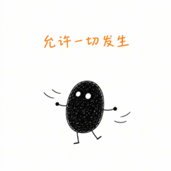
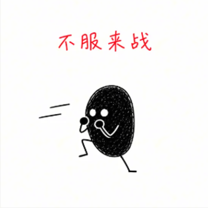
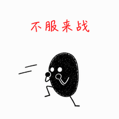
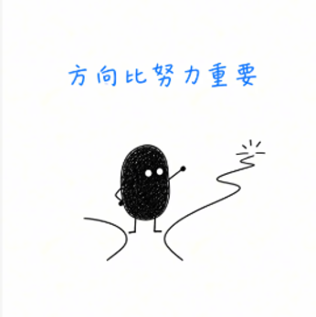
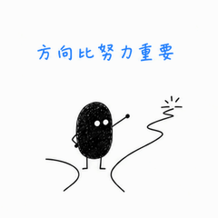
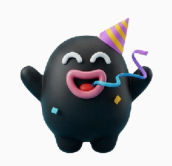
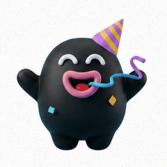

# Static Meme to GIF

把一张静态表情包，延展成一段有动作、有节奏的循环 GIF。

[English](README.en.md) · [技能指令](SKILL.md) · [测试案例](examples/README.md) · [贡献指南](CONTRIBUTING.md)

这是一个面向 Codex 等支持 `SKILL.md` 的 AI 助手的技能，附带可独立运行的拆帧、合成和压缩脚本。**动作由图像生成工具创作，Python 脚本负责把已有帧做成 GIF。** 它不是独立的图生视频模型，也不包含模型服务或 API 密钥。

## 看看效果

以下是实际生成的四个测试案例，均为 **12 帧、2 秒、无限循环**。右侧为 240×240 轻量版。

| 案例 | 原图 | 动态结果 |
| --- | --- | --- |
| 允许一切发生：轻摆、抬脚 |  |  |
| 不服来战：蓄力、出拳、收拳 |  |  |
| 方向比努力重要：看路、抬手指路 |  |  |
| 派对小怪兽：轻弹、挥手、吹卷伸缩 |  |  |

这些案例保留了实际结果，包括轻微的角色、文字和背景重绘变化，并不是逐像素一致性的承诺。第三组动作较小；第四组的渐变质感更容易受到 GIF 调色板影响。完整帧、生成提示词、来源说明与检查记录见 [examples](examples/README.md)。

## 它解决什么问题

原始实践分为三步：让图像模型延展同一个表情的前后动作，把图片合成 GIF，再压缩到方便分享的尺寸。这个技能把动作设计、一致性要求、节奏选择、压缩和检查整理到同一个流程中。


默认目标为 12 个不同动作帧；10–16 帧是可调整的经验范围。2 秒来自作者的实际对比偏好，不是普适最优时长。帧数变化时，仍保持整轮 2 秒；不会固定每帧 0.2 秒。1.2 秒可作为额外对比。

## 安装到 Codex

需要 Git，以及能使用图像生成/编辑工具的 Codex 环境。将仓库放入技能目录：

```bash
git clone https://github.com/tinyray1314/static-meme-to-gif.git \
  "${CODEX_HOME:-$HOME/.codex}/skills/static-meme-to-gif"
```

如果该目录已经存在，先检查现有版本，不要直接覆盖。开启新会话后，附上原图并输入：

> 用 $static-meme-to-gif 把这张静态表情包变成动态表情，默认 2 秒循环，交付轻量版和大尺寸版。

也可以要求：“用这些已有帧合成 GIF”或“把这个 GIF 压缩到指定体积”。这些任务不需要图像生成工具。其他助手可以读取 `SKILL.md`，但需要适配它们实际可用的图像与本地文件工具。

## 独立运行脚本

需要 **Python 3.10+ 和 Pillow**。以下命令从仓库根目录运行；不调用图像服务，不需要 API key。

```bash
python3 -m venv .venv
source .venv/bin/activate
# Windows PowerShell: .venv\Scripts\Activate.ps1
python -m pip install -r requirements.txt

# 使用仓库中已经生成的帧，重建第一个案例
python scripts/build_gif.py \
  --manifest examples/allow-everything/manifest.json \
  --out output/allow-everything
```

输出 `master.gif`（帧原尺寸）、`small.gif`（默认 240×240）和 `report.json`（实际帧数、时长、体积、循环设置及预算结果）。输出目录中已有同名成品时会拒绝覆盖。

### 使用自己的动作帧

帧尺寸必须相同，按播放顺序写入清单；路径相对于清单文件：

```json
{
  "frames": ["frames/01.png", "frames/02.png", "frames/03.png"],
  "total_ms": 2000
}
```

示例为说明结构而缩短；动作生成通常使用 10–16 帧。脚本支持至少两帧。

需要起势或收尾停顿时，添加 `durations_ms`，例如上述三帧可用 `[600, 800, 600]`。每项须为至少 20 毫秒的 10 毫秒整数倍，数量须匹配帧数，总和须等于 `total_ms`。默认均分会分配 GIF 的 10 毫秒时间单位，12 帧/2 秒得到 8×170ms + 4×160ms。

### 从规则网格拆帧

本仓库四个案例均使用 1448×1086 的 4×3 网格，每格 362×362；已检查没有格间留白。拆帧工具只接受**已确认的等大、无边框、无间隔网格**，不能自动理解任意联系表。

```bash
python scripts/split_sheet.py \
  --image examples/allow-everything/sprite-sheet.png \
  --columns 4 --rows 3 --out output/allow-frames
python scripts/build_gif.py \
  --manifest output/allow-frames/manifest.json \
  --out output/allow-rebuilt
```

有标题、边框、不等宽单元或留白的图，需先测量实际边界；不要盲目等分。逐张生成的独立动作帧不需要这一步。

### 压缩已有 GIF

```bash
python scripts/build_gif.py \
  --gif examples/party-creature/master.gif \
  --out output/party-small --size 240 --max-kb 500
```

`--max-kb` 按 KiB（1024 字节）计算，默认 500 KiB。脚本保留时序并输出无限循环；先缩放，再依次尝试 256、128、64 色，不自动删帧。非方图等比补边，不拉伸。超过预算仍会留下结果，并在报告中标记 `budget_met: false`；退出码不代表体积一定合格，调用方需读取报告。

**透明输入默认合成到白色背景**，可通过 `--background '#FFFFFF'` 指定其他不透明底色。当前脚本不保留透明通道。相邻相同帧可能被编码器合并，因此输入帧数与最终编码帧数可能不同，但整轮时长应保持一致。

## 边界与验收

- 一致性依赖图像工具。复杂照片、细字、长线条和立体材质可能漂移；不能保证任意图片都能自然动起来。
- 不绑定具体图像模型版本；本仓库案例使用内置图像工具，未独立确认其底层模型版本。生成具有随机性，提示词不能保证复现相同像素。
- 本地可重复的是“已有帧 → GIF”的流程；Pillow 版本可能影响文件字节和调色板，不承诺文件哈希相同。
- 240×240 和 500 KiB 是项目预设，**不是微信官方限制**。实际导入微信未验证，商店投稿规则也应另行检查。
- 文件检查不等于动作验收。应播放至少两轮，检查首尾跳切、闪烁、残影，以及缩小后的文字可读性。
- 当前案例已检查帧网格和缩小后的首帧；未独立完成连续播放验收。检查记录保留这一状态。

## 开发与贡献

```bash
python -m unittest discover -s tests -v
```

测试覆盖时序、尺寸、帧合成、已有 GIF 重编码、体积预算、防覆盖和规则网格拆分。欢迎提交带原图、预期动作、实际 GIF 与问题说明的案例；提交素材前请确认可以公开分享。更多见 [CONTRIBUTING.md](CONTRIBUTING.md)。

## 许可

技能指令、原创文档和代码使用 [MIT License](LICENSE)。示例原图及衍生图片/GIF 单独说明，**不因本仓库 MIT 许可而获得额外素材授权**；详见 [素材说明](examples/ASSET_NOTICE.md)。
